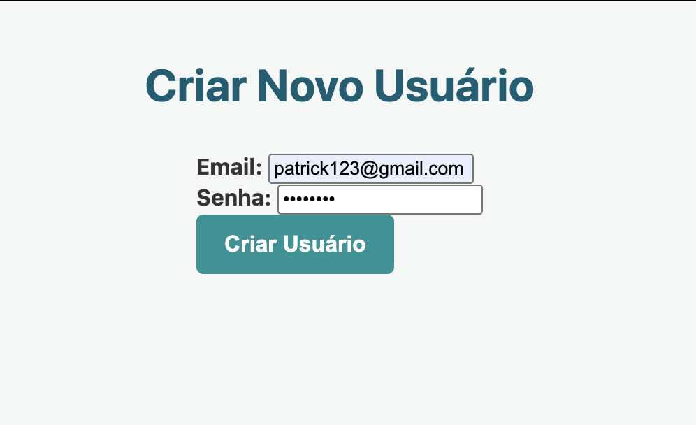
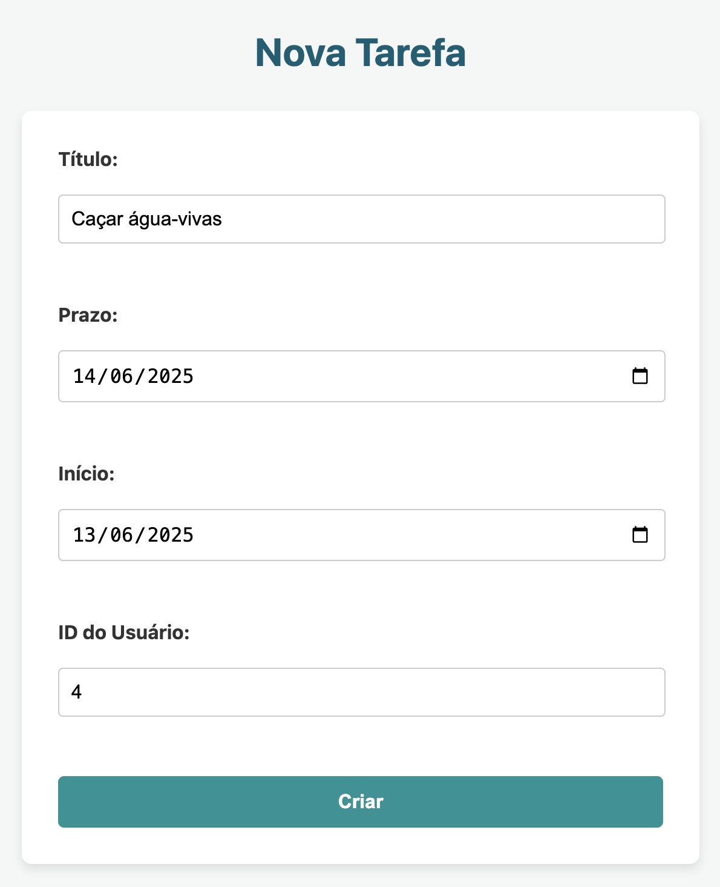
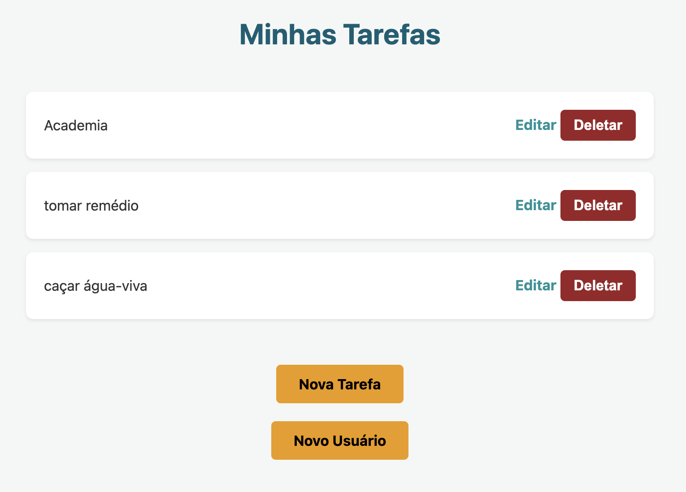
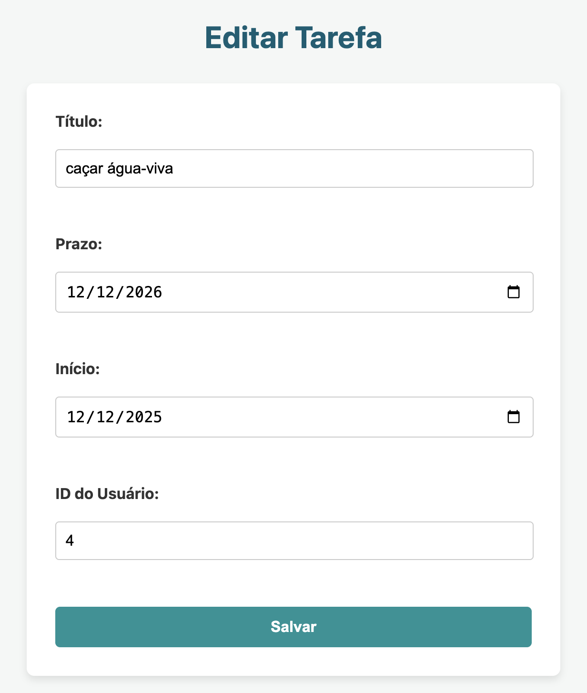

# Web Application Document - Projeto Individual - Módulo 2 - Inteli

**_Os trechos em itálico servem apenas como guia para o preenchimento da seção. Por esse motivo, não devem fazer parte da documentação final._**

## Nome do Projeto

#### Autor do projeto

## Sumário

1. [Introdução](#c1)
2. [Visão Geral da Aplicação Web](#c2)
3. [Projeto Técnico da Aplicação Web](#c3)
4. [Desenvolvimento da Aplicação Web](#c4)
5. [Referências](#c5)

<br>

## <a name="c1"></a>1. Introdução (Semana 01)

À medida que o tempo passa, as pessoas que possuem uma vida agitada precisam lembrar de muitos afazeres no dia e, muitas vezes, não é prático transportar uma agenda física todos os dias, para todos os locais. Pensando nisso, irei desenvolver um sistema de gerenciador de tarefas, onde o usuário poderá definir suas tarefas, que terão: título, prazo e data de início. O objetivo principal é oferecer uma alternativa digital prática e acessível para o controle da rotina, diretamente pelo computador ou celular.

Cada usuário deverá possuir um e-mail e senha para cadastro no sistema, garantindo segurança e individualidade no acesso às informações.

O objetivo é fazer com que esses dados sejam armazenados em um fluxo correto e sustentável, para que o sistema possa funcionar de forma fluida, leve e confiável para os usuários. A proposta é entregar algo simples, mas funcional, focado na experiência do usuário e na organização pessoal.

Em termos mais técnicos, o banco de dados possuirá, inicialmente, duas entidades principais: usuário e tasks. A primeira conterá instâncias como: ID, e-mail e senha. Já a entidade tasks contará com: ID, título, prazo, data de início e ID_usuário. Essa estrutura permitirá uma conexão direta entre tarefas e seus respectivos usuários, garantindo organização e facilidade no gerenciamento.

---

## <a name="c2"></a>2. Visão Geral da Aplicação Web

### 2.1. Personas (Semana 01 - opcional)

_Posicione aqui sua(s) Persona(s) em forma de texto markdown com imagens, ou como imagem de template preenchido. Atualize esta seção ao longo do módulo se necessário._

### 2.2. User Stories (Semana 01 - opcional)

_Posicione aqui a lista de User Stories levantadas para o projeto. Siga o template de User Stories e utilize a referência USXX para numeração (US01, US02, US03, ...). Indique todas as User Stories mapeadas, mesmo aquelas que não forem implementadas ao longo do projeto. Não se esqueça de explicar o INVEST de 1 User Storie prioritária._

---

## <a name="c3"></a>3. Projeto da Aplicação Web

### 3.1. Modelagem do banco de dados (Semana 3)

## Diagrama do Projeto


```
CREATE TABLE usuarios (
  id SERIAL PRIMARY KEY,
  email VARCHAR(100) UNIQUE NOT NULL,
  senha VARCHAR(200) NOT NULL
);

INSERT INTO usuarios (email, senha)
VALUES
  ('leonardobote321nitro@example.com', 'bolinhodearroz44'),
  ('vasconelho654tribo@example.com', 'serelepeoi90');

CREATE TABLE tasks (
  id SERIAL PRIMARY KEY,
  titulo VARCHAR(100) NOT NULL,
  prazo TIMESTAMP,
  inicio DATE,
  id_usuario INT,
  FOREIGN KEY (id_usuario) REFERENCES usuarios(id) ON DELETE CASCADE
);

INSERT INTO tasks (titulo, prazo, inicio, id_usuario)
VALUES 
  ('Ir à academia', '2025-06-10 14:00:00', '2025-06-04', 1),


```

### 3.1.1 BD e Models (Semana 5)

Para este sistema, a modelagem dos dados foi pensada de forma direta, sem a utilização de uma camada de ORM (Object-Relational Mapper) que abstrairia o banco de dados. Desta forma, os "Models" da aplicação são representados, fundamentalmente, pela própria estrutura das tabelas usuarios e tasks definidas no banco de dados PostgreSQL. A lógica para interagir com esses dados, ou seja, para realizar operações baseadas no CRUD, é implementada através de comandos SQL puros. Estes comandos são escritos diretamente nos controllers da aplicação ou, em alguns casos, podem estar encapsulados em funções de serviço auxiliares, e são executados utilizando o pacote pg do Node.js para a comunicação com o banco.

A tabela usuarios é a base para a gestão dos usuários do sistema. Ela armazena informações essenciais como um id único para cada pessoa, seu email (que também funciona como um identificador único para login) e a senha necessária para acesso à plataforma.

Já a tabela tasks é onde são guardados os detalhes de cada tarefa que os usuários gerenciam. Cada tarefa possui um id (que é auto-incrementado pelo banco de dados), um titulo descritivo, informações de prazo e data de inicio (ambos como timestamps) e um id_usuario. Este último campo estabelece a ligação direta com a tabela usuarios, assegurando que cada tarefa tenha um proprietário e permitindo que os usuários visualizem e gerenciem apenas suas próprias atividades.

### 3.2. Arquitetura (Semana 5)

_Posicione aqui o diagrama de arquitetura da sua solução de aplicação web. Atualize sempre que necessário._

**Instruções para criação do diagrama de arquitetura**

- **Model**: A camada que lida com a lógica de negócios e interage com o banco de dados.
- **View**: A camada responsável pela interface de usuário.
- **Controller**: A camada que recebe as requisições, processa as ações e atualiza o modelo e a visualização.

_Adicione as setas e explicações sobre como os dados fluem entre o Model, Controller e View._

### 3.3. Wireframes (Semana 03 - opcional)

_Posicione aqui as imagens do wireframe construído para sua solução e, opcionalmente, o link para acesso (mantenha o link sempre público para visualização)._

### 3.4. Guia de estilos (Semana 05 - opcional)

_Descreva aqui orientações gerais para o leitor sobre como utilizar os componentes do guia de estilos de sua solução._

### 3.5. Protótipo de alta fidelidade (Semana 05 - opcional)

_Posicione aqui algumas imagens demonstrativas de seu protótipo de alta fidelidade e o link para acesso ao protótipo completo (mantenha o link sempre público para visualização)._

### 3.6. WebAPI e endpoints (Semana 05)

A aplicação expõe uma WebAPI RESTful para permitir a interação com os recursos do sistema, primariamente para o gerenciamento de tarefas e usuários. Todos os endpoints da API estão agrupados sob o prefixo base /api. A comunicação com a API utiliza o formato JSON para os corpos das requisições e respostas.

**Endpoints de Tarefas**

A gestão de tarefas é realizada através dos seguintes endpoints:

1. Criação de Nova Tarefa: Para adicionar uma nova tarefa ao sistema, é disponibilizado o endpoint POST /api/tasks. Este endpoint espera um corpo de requisição no formato JSON contendo os detalhes da tarefa, incluindo titulo (string, obrigatório), prazo, inicio, e id_usuario. Em caso de sucesso, a API retorna o status 201 Created e um objeto JSON representando a tarefa recém-criada, incluindo seu id gerado pelo sistema. Se os dados fornecidos forem inválidos ou campos obrigatórios estiverem ausentes, um status 400 Bad Request será retornado com uma mensagem de erro. Erros de chave estrangeira podem resultar em um erro 500 Internal Server Error ou um erro mais específico dependendo da configuração do banco.

2. Listagem de Todas as Tarefas: Para obter uma lista de todas as tarefas cadastradas, utiliza-se o endpoint GET /api/tasks. Esta requisição não exige corpo nem parâmetros adicionais. A API responderá com o status 200 OK e um array JSON contendo todos os objetos de tarefa. Se não houver tarefas, um array vazio será retornado. Em caso de falha na consulta ao banco, um erro 500 Internal Server Error pode ocorrer.

3. Atualização de Tarefa Existente: A modificação de uma tarefa existente é realizada através do endpoint PUT /api/tasks/:id, onde :id representa o identificador numérico da tarefa a ser atualizada. O corpo da requisição deve ser um JSON contendo os campos a serem alterados: titulo (string), prazo (timestamp ISO), e inicio (timestamp). Se a tarefa for encontrada e atualizada com sucesso, a API retorna o status 200 OK e o objeto JSON da tarefa com os dados modificados. Caso a tarefa com o id especificado não seja encontrada, um status 404 Not Found é retornado.

4. Exclusão de Tarefa: Para remover uma tarefa do sistema, o endpoint DELETE /api/tasks/:id é utilizado, onde :id é o ID da tarefa a ser excluída. Esta requisição não necessita de um corpo. Se a tarefa for encontrada e excluída com sucesso, a API responde com o status 200 OK, uma mensagem de confirmação, e o objeto da tarefa que foi removida. Se nenhuma tarefa com o id fornecido for encontrada, um status 404 Not Found será retornado.

**Endpoints de Usuários**

O sistema também possui endpoints para gerenciamento de usuários, localizados sob /api/users. Estes incluem funcionalidades para criar, listar, buscar por ID, atualizar e excluir usuários.

### 3.7 Interface e Navegação (Semana 07)

**Visão Geral do Frontend:**

O frontend foi desenvolvido com uma abordagem híbrida, focada em criar uma experiência de usuário fluida e reativa. A arquitetura combina a renderização inicial de páginas no servidor, utilizando EJS, com uma interatividade dinâmica no lado do cliente, implementada com JavaScript puro e a Fetch API.

O principal objetivo dessa arquitetura foi evitar recarregamentos completos da página durante operações de dados (como criar ou deletar uma tarefa), tornando a aplicação mais rápida e com uma sensação de modernidade. A estilização foi feita com CSS puro, priorizando uma interface limpa, organizada e funcional.

**Estrutura e Componentes das Views (EJS)**

As views, localizadas em views/pages, são responsáveis por estruturar o HTML de cada tela do sistema. O EJS foi utilizado para permitir a inserção de dados vindos do backend diretamente no HTML no momento da renderização inicial, como no caso da listagem de tarefas.

As principais views desenvolvidas foram:

- Página Principal (tasks.ejs): É o painel central da aplicação. Esta página é responsável por listar todas as tarefas existentes de um usuário. Ela serve como ponto de partida para todas as outras ações, contendo os botões de navegação para "Nova Tarefa", "Novo Usuário", e os controles de "Editar" e "Deletar" para cada item da lista.

- Formulários de Criação e Edição: Foram criadas views dedicadas para os formulários, garantindo que a experiência de inserção de dados seja focada e sem distrações. Isso inclui newTask.ejs, editarTask.ejs e newUser.ejs. Todos seguem um design consistente para facilitar o uso.

- Estilização e Experiência do Usuário (CSS):
A estilização visual do projeto foi construída do zero com CSS puro. O foco foi criar uma interface que fosse ao mesmo tempo agradável e intuitiva.

1. Layout: Foi utilizado Flexbox para organizar os principais componentes de layout, como o alinhamento de itens nos cards de tarefas, a centralização de contêineres e a disposição dos campos nos formulários.
2. Usabilidade: Elementos interativos como botões e campos de input possuem feedback visual claro, com transições suaves e mudanças de estilo nos estados :hover e :focus, guiando o usuário em suas ações.
3. Consistência Visual: Uma paleta de cores coesa e uma tipografia legível foram aplicadas em todo o sistema para criar uma identidade visual consistente e profissional.

**Integração Dinâmica com a API via Fetch**

A interatividade do sistema é o seu grande diferencial. Em vez de submissões de formulário tradicionais que recarregam a página, toda a comunicação de dados é feita de forma assíncrona no background.

O mecanismo funciona da seguinte forma:

1. Um script JavaScript é adicionado a cada página com um formulário (ex: newUser.ejs).
2. Esse script adiciona um "ouvinte" ao evento de submit do formulário.
3. Quando o usuário clica em "Criar", o script previne o comportamento padrão do formulário (event.preventDefault()).
4. Os dados dos campos de input são coletados.
5. Uma requisição fetch é montada e enviada para o endpoint correspondente da API no backend (ex: POST /usuarios). O corpo da requisição é um objeto JSON com os dados do formulário.
6. O script aguarda a resposta do servidor. Em caso de sucesso, ele exibe um alerta (alert()) para o usuário e o redireciona para a página principal (window.location.href), onde os novos dados estarão visíveis. Em caso de erro, um alerta com a mensagem de erro do backend é exibido.
7. O mesmo princípio se aplica à exclusão de tarefas, onde o botão "Deletar" aciona uma função que envia uma requisição DELETE via fetch.


---

**Criação de Usuário:** O fluxo pode se iniciar na tela de criação de um novo usuário.



---

**Criação de Tarefa:** O usuário clica em "Nova Tarefa", é levado ao formulário, preenche os dados e salva.



---

**Lista Atualizada:** Após a criação, ele é redirecionado de volta à tela principal, que agora exibe a tarefa recém-criada.



---

**Edição:** Ao clicar em "Editar", o usuário é levado a um formulário pré-preenchido com os dados da tarefa, onde pode fazer alterações e salvar.




---

## <a name="c4"></a>4. Desenvolvimento da Aplicação Web (Semana 8)

### 4.1 Demonstração do Sistema Web (Semana 8)

_VIDEO: Insira o link do vídeo demonstrativo nesta seção_
_Descreva e ilustre aqui o desenvolvimento do sistema web completo, explicando brevemente o que foi entregue em termos de código e sistema. Utilize prints de tela para ilustrar._

### 4.2 Conclusões e Trabalhos Futuros (Semana 8)

_Indique pontos fortes e pontos a melhorar de maneira geral._
_Relacione também quaisquer outras ideias que você tenha para melhorias futuras._

## <a name="c5"></a>5. Referências

_Incluir as principais referências de seu projeto, para que o leitor possa consultar caso ele se interessar em aprofundar._<br>

---

---
